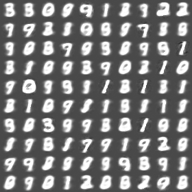
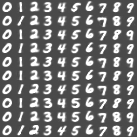
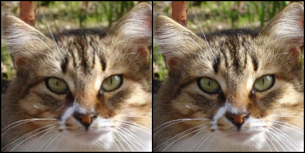
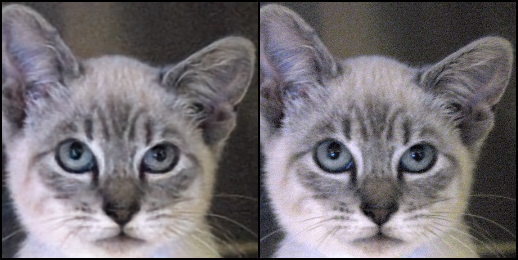
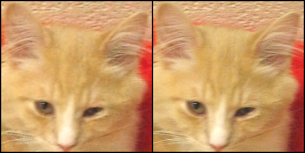
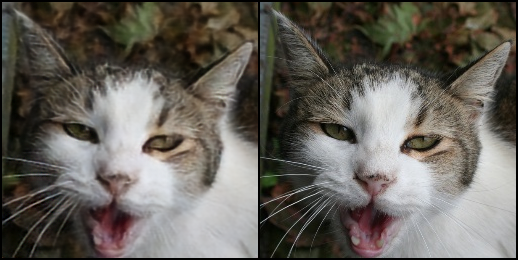
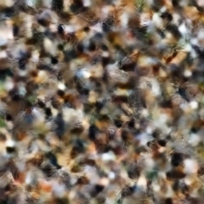

# vae_playground
implementation of different variational autoencoders using pytorch

to train on the MNIST dataset with a semi-supervised VAE, run
`python train_mnist.py  --is_semi=1`, losses and models will be saved under `./logs` and `./models`.

to train on the MNIST dataset with a Vanilla VAE (no conditional generation), run
`python train_mnist.py  --is_semi=0`, losses and models will be saved under `./logs` and `./models`.

to generate new digits with a trained semi-supervised VAE, run
`python test_vae.py --is_semi=1 --model_path=$path_to_your_model`, outputs will be saved under `./out`.

to generate new digits with a Vanilla VAE, run
`python test_vae.py --is_semi=0 --model_path=$path_to_your_model`, outputs will be saved under `./out`.

# Vanilla VAE results:
Vanilla VAE without classifier            |  Semi-supervised Vanilla VAE with classifier
:-------------------------:|:-------------------------:
  |   

For the cat images, commands are similar, I haven't implemented the semi-supervised version of the cat dataset. It should be conditioned on the positions of facial features. 

to train, run `python train_vae.py --dataset_path=$path_to_dataset`

to test, run `python test_vae_cat.py --model_path=$model_path --dataset_path=$path_to_testdataset`

# Reconstruction of Cat images (trained on cat dataset on Kaggle):
Reconstructed images on the left, original images on the right
 
 
 
 

# Random sample (Failed, TODO)
 
